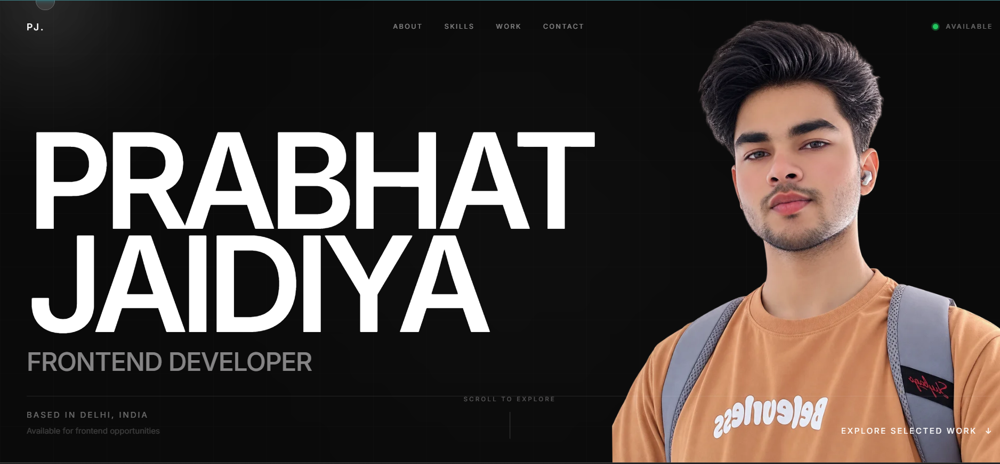

# Prabhat Jaidiya — Portfolio

A modern, responsive developer portfolio built to showcase my projects, technical skills, experience, and frontend development journey.

The portfolio focuses on clean typography, subtle animations, interactive elements, responsive layouts, and a minimal dark visual design.

## Live Website

🌐 **Portfolio:** https://portfolio-mocha-xi-f9ohsuh54e.vercel.app/

---

## Preview



---

## About

This portfolio represents my work and learning journey as a frontend developer.

I enjoy building modern web interfaces that are:

- Responsive across devices
- Interactive without being distracting
- Clean and accessible
- Performance-conscious
- Built with reusable components

The website also reflects my ongoing transition from frontend development toward full-stack development.

---

## Features

- Responsive design for mobile, tablet, and desktop
- Animated hero section
- Interactive Bitmoji
- Scroll-based animations
- Custom cursor
- Global mouse-following glow
- Animated project cards
- Featured project system
- Dedicated skills section
- Technology logos
- Sticky About section
- Experience / development journey
- Contact section
- GitHub and LinkedIn links
- Mobile navigation menu
- Smooth UI transitions
- Dark minimalist design

---

## Tech Stack

### Frontend

- React
- JavaScript
- Tailwind CSS
- Motion
- Vite

### Libraries & Tools

- React Icons
- Recharts
- Context API
- Local Storage
- Git
- GitHub
- Vercel

---

## Sections

### Hero

Introduces me as a frontend developer with an animated name reveal, Bitmoji and scroll-based transitions.

### About

A detailed introduction covering my development approach, interests and current learning direction.

### Skills

A categorized overview of the technologies I currently use and the technologies I'm learning.

### Projects

Selected projects demonstrating practical frontend development, API integration, state management, responsive design and data visualization.

### Experience

A timeline representing my development journey and progression toward full-stack development.

### Contact

Ways to connect with me through email, GitHub and LinkedIn.

---

## Featured Projects

### Expense Tracker

A responsive personal finance dashboard designed to track expenses, manage budgets and visualize spending patterns through interactive financial insights.

**Built with:**

- React
- Vite
- Tailwind CSS
- Recharts
- Context API
- Local Storage

🔗 **Live:** https://expense-tracker-lovat-pi.vercel.app/

💻 **Repository:** https://github.com/prabhatjaidiya/Expense-Tracker

---

### Weather App

A responsive weather application that provides real-time conditions, forecasts and location-based weather information through a weather API.

**Built with:**

- React
- JavaScript
- Tailwind CSS
- REST API

🔗 **Live:** https://weather-app-7cfd.vercel.app/

💻 **Repository:** https://github.com/prabhatjaidiya/Weather-App

---

## Project Structure

```text
portfolio/
├── public/
│   ├── favicon.svg
│   └── skills/
│
├── src/
│   ├── assets/
│   │   ├── projects/
│   │   │   ├── expense-tracker/
│   │   │   └── weather/
│   │   └── bitmoji.png
│   │
│   ├── components/
│   │   ├── About.jsx
│   │   ├── Contact.jsx
│   │   ├── CustomCursor.jsx
│   │   ├── Experience.jsx
│   │   ├── Footer.jsx
│   │   ├── GlobalGlow.jsx
│   │   ├── Hero.jsx
│   │   ├── Navbar.jsx
│   │   ├── ProjectCard.jsx
│   │   ├── ProjectPreview.jsx
│   │   └── Skills.jsx
│   │
│   ├── data/
│   │   └── projects.js
│   │
│   ├── App.jsx
│   ├── main.jsx
│   └── index.css
│
├── index.html
├── package.json
├── tailwind.config.js
└── vite.config.js